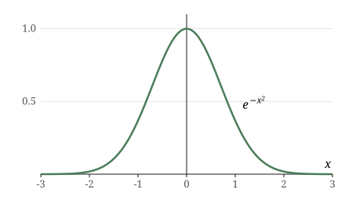

Welcome to my blog! This is the first post, published on September 20, 2026. It
exercises the features of the site, so that we have something to test and
iterate on: Markdown, [links](https://en.wikipedia.org/wiki/Blog), **bold** and
*italic* text, LaTeX math, images, tables, code blocks, blockquotes, and
lists.

## Math

Inline math is written in LaTeX between dollar signs. Euler's identity,
$e^{i\pi} + 1 = 0$, is sometimes called the most beautiful equation in
mathematics. Display math goes on its own lines, between double dollar
signs:

$$\int_{-\infty}^{\infty} e^{-x^2}\,dx = \sqrt{\pi}$$

Some more examples: the quadratic formula,
$x = \frac{-b \pm \sqrt{b^2 - 4ac}}{2a}$; Fermat's little theorem,
$a^{p-1} \equiv 1 \pmod{p}$; a binomial coefficient, $\binom{n}{k}$; and a
summation, $\sum_{i=1}^{n} i = \frac{n(n+1)}{2}$. Note that `$...$` in a code
span, or `$$` in a fenced code block, is not rendered as math:

```
$math(x)$ and $$display math$$ are literal inside code blocks.
```

## Images

Images in blog/ are copied to the site as-is. Refer to them with a path
relative to blog/:



The plot above is of $e^{-x^2}$, the integrand of the display equation from
the previous section.

## Code

A quick numerical check of the Gaussian integral, using the trapezoid rule:

```python
import math

def gauss(x):
    return math.exp(-x * x)

N, lo, hi = 100000, -10.0, 10.0
step = (hi - lo) / N
area = (gauss(lo) + gauss(hi)) / 2 * step
for i in range(1, N):
    area += gauss(lo + i * step) * step
print(area)  # 1.7724538509051715, i.e. sqrt(pi)
```

## Tables

A cheat sheet for the syntax understood by the build script:

| Syntax | Result |
| ------ | ------ |
| `$x^2$` | Inline math |
| `$$x^2$$` | Display math (on its own lines) |
| `` | An image from blog/img/ |
| `[text](url)` | A link |
| `**bold**`, `*italic*` | Bold, italic |

## And the rest

> Blockquotes are useful for asides, like this one.

An unordered list:

- Markdown files go in `blog/`, named like `2026-09-20-hello-world.md`.
- The publication date is taken from the file name.
- The short title is the `title` field of the front matter, falling back to
  the file name.

An ordered list:

1. Write the post in Markdown, with LaTeX math between dollar signs.
2. Run `make` to render the post and update the blog index.
3. Deploy as usual, e.g. by pushing to `main`.
